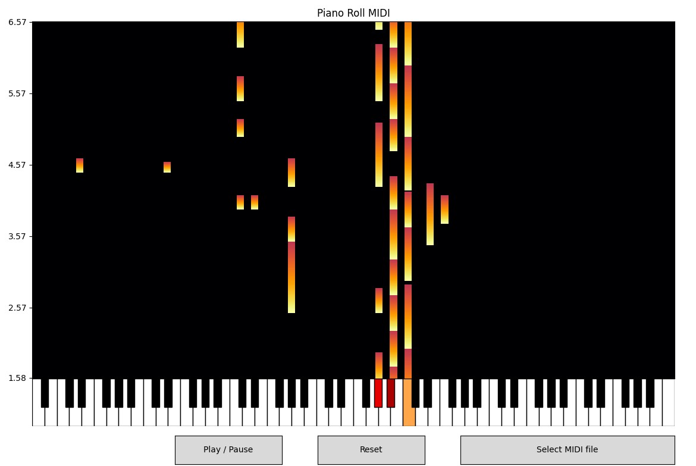
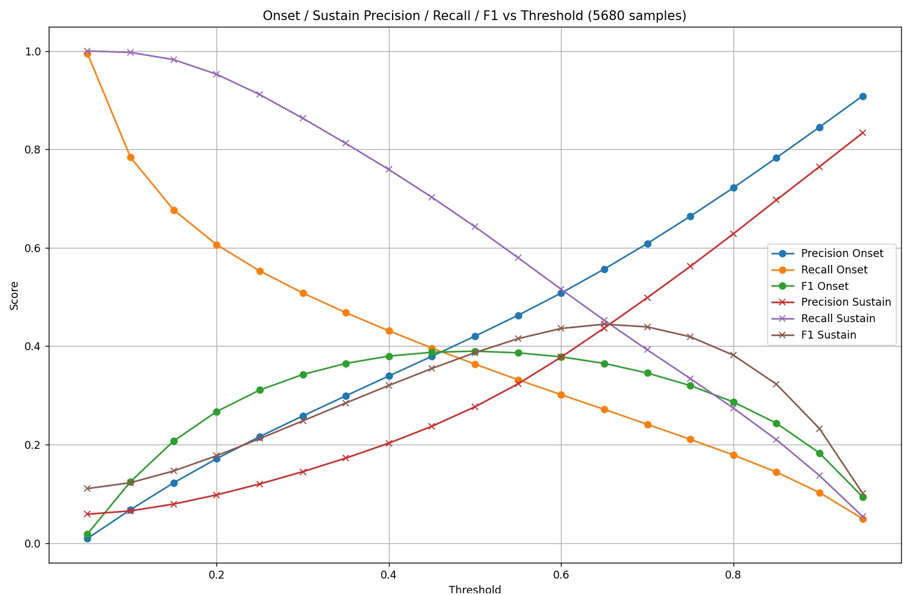
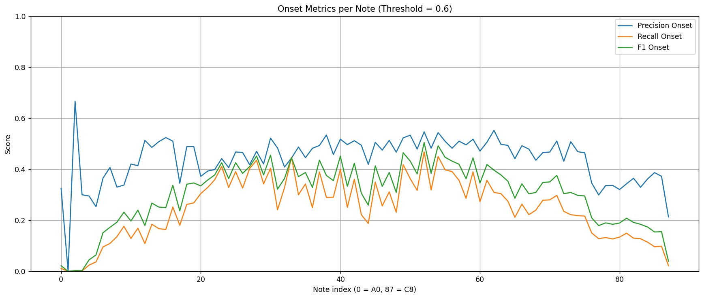
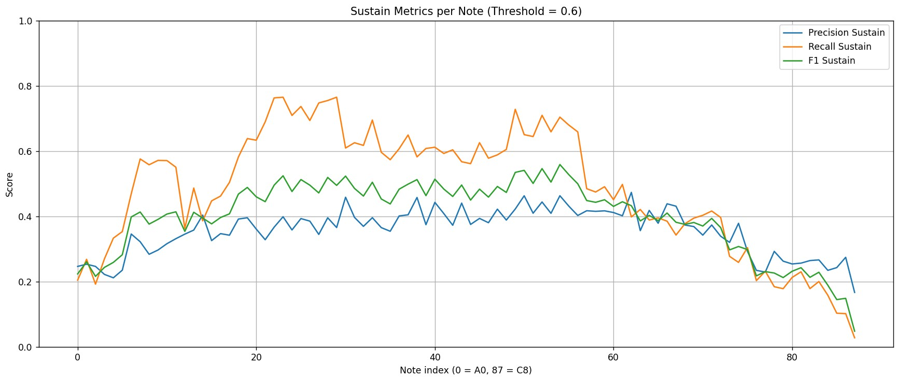
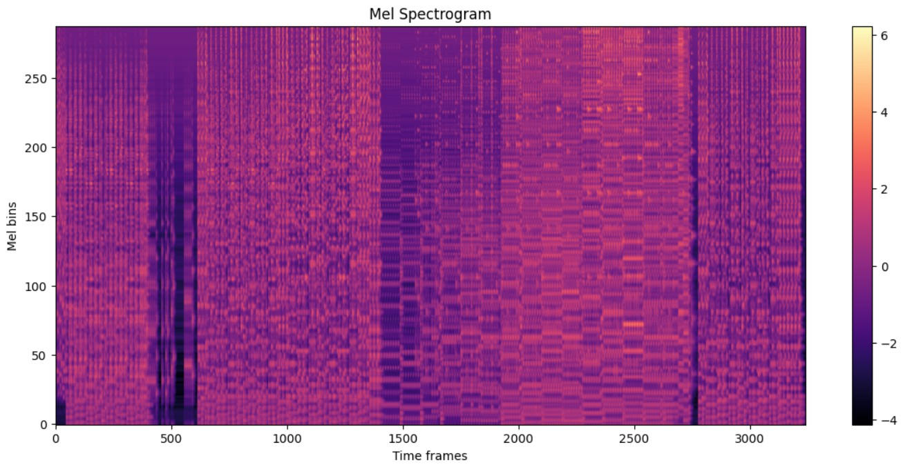
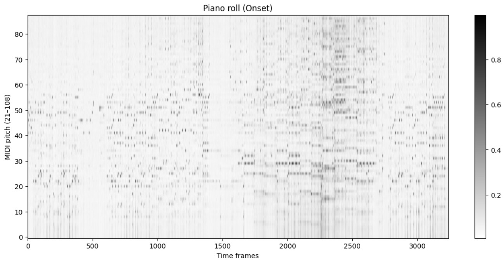
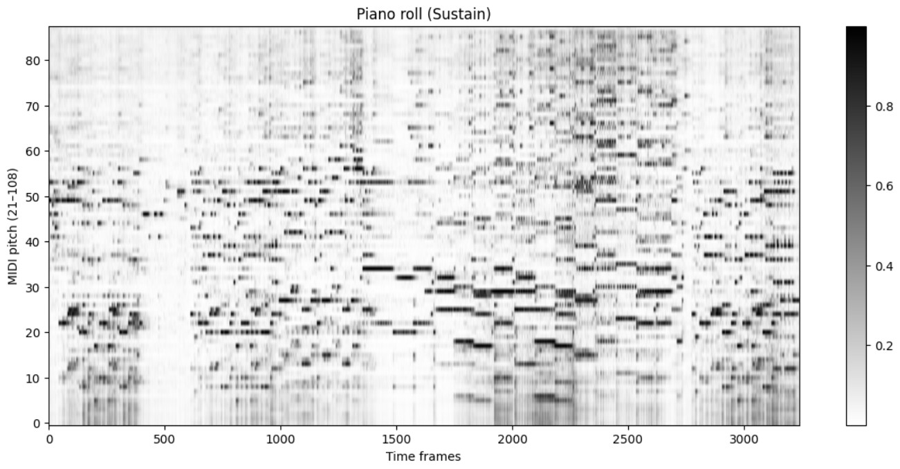
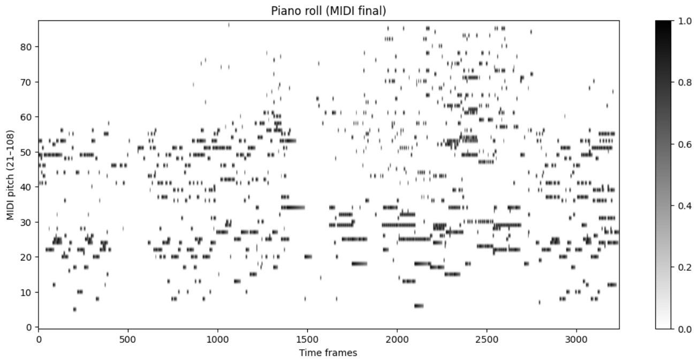

# audio2piano
Convert any audio signal into an 88-key piano approximation using a lightweight and fast machine learning model.

---

## Table of Contents
1. [Installation](#installation)  
2. [Usage](#usage)  
3. [Objectives](#objectives)  
4. [Performance](#performance)  
5. [How It Works](#how-it-works)  
6. [Credits](#credits)  

---

## Installation
Clone the repository and set up a virtual environment to run Audio2Piano.

    git clone https://github.com/NicoutG/audio2piano.git
    cd audio2piano

### Create a Python virtual environment

#### Linux / macOS

    python3 -m venv .venv
    source .venv/bin/activate

#### Windows (PowerShell)

    python -m venv .venv
    .venv\Scripts\Activate.ps1

### Install dependencies

    python -m pip install --upgrade pip
    pip install -r requirements.txt

---

## Usage

Audio2Piano can be used either through the full demo notebook or by directly using the transcription module.

### Full Project

1. Place any `.wav` files you want to transcribe into:

```
data/musics/wav(input)/
```

2. Open and run the notebook:

```
audio2piano_demo.ipynb
```

3. The generated MIDI files will be saved in:

```
data/musics/midi(output)/
```

4. You can also visualize the generated MIDI files using the `midi_visualizer.py` script. Simply run:

```
python midi_visualizer.py
```

Then select a MIDI file from the `data/musics/midi(output)/` folder. The piano roll window will display the notes over time:



### Minimal Usage — Using Only the Transcriber

If you only need the transcription engine, you only need:

- `src/audio2piano.py`
- `weights/model_weights.pth`

#### Minimal Required Dependencies

```python
from pathlib import Path
import torch
import torch.nn as nn
import torch.nn.functional as F
import librosa
import numpy as np
import mido
```

Install them with:

```bash
pip install torch librosa numpy mido
```

#### Example Usage

```python
from audio2piano import transcribe

transcribe(
    input_path="data/musics/wav/your_file.wav",
    output_path="data/musics/midi/your_file.mid",
    weights_path="weights/model_weights.pth"
)
```

### Notes

- Input: any mono or stereo `.wav` file  
- Output: 88-key piano MIDI approximation  
- Frame resolution: 0.05 seconds  
- Onset threshold: 0.6 (configurable)

---

## Objectives
Audio2Piano is designed to:

- Convert arbitrary audio signals into an 88-key piano representation.  
- Provide a **fast and lightweight model** suitable for real-time or offline analysis.  
- Visualize music in both **audio and piano-roll form**.  
- Facilitate experimentation and learning with music and AI.

---

## Performance
Audio2Piano has been evaluated on audio files generated with random instruments. These results are **illustrative** and may not fully represent performance on real-world recordings. **The metrics below correspond to the raw model predictions, before any postprocessing is applied.**

The metrics below correspond to a **note activation threshold of 0.6**.

| Metric        | Onset | Sustain |
|---------------|-------|---------|
| Precision     | 0.49  | 0.38    |
| Recall        | 0.32  | 0.56    |
| F1-score      | 0.39  | 0.45    |


*Figure 1: Precision, Recall, and F1-score on test audio samples.*


*Figure 2: Precision, Recall, and F1-score on test audio samples per notes for the onset.*


*Figure 3: Precision, Recall, and F1-score on test audio samples per notes for the sustain.*

---

## How It Works

Audio2Piano relies on a lightweight neural network to map audio input to piano keys. The main processing steps are:

1. **Audio Preprocessing**  
   The input audio is resampled to 22 kHz and converted into a Mel spectrogram, which serves as the model input.

  
*Figure 4: Audio preprocessing pipeline.*

2. **Model Prediction**  
    The model predicts, for each 0.05-second frame, which piano keys are active and which notes start at that frame.

   - **Onset** detection determines when a note starts and at which frame.


*Figure 5: Onset prediction output.*

   - **Sustain** prediction determines how long each note remains active.

  
*Figure 6: Sustain prediction output.*

3. **Postprocessing**  
   The predictions are converted into a MIDI output through a postprocessing stage.

   - Onsets are extracted using a threshold. If multiple onsets of the same note occur within 0.2 seconds, only the first one is kept to avoid duplicates.
   - No strict threshold is applied to sustain predictions. Instead, note energy naturally decays at each frame, and sustain predictions reinforce the energy to keep the note active.

   After postprocessing, the final note activations are converted into a MIDI file.

  
*Figure 7: Final MIDI reconstruction.*

---

## Credits
Example WAV files included in this repository:

- `example0.wav` – Kakegurui - Desire for Recklessness
- `example1.wav` – Pixies - Where Is My Mind
- `example2.wav` – Return of the Obra Dinn - Main Theme
- `example3.wav` – Zelda Majora's Mask - Deku Palace
- `example4.wav` – Imase - Et Cetera
- `example5.wav` – Clair Obscur Expedition 33 - We Lost

---

## Notes
- Audio2Piano is designed to be **fast and lightweight**, suitable for desktop usage without high-end GPUs.  
